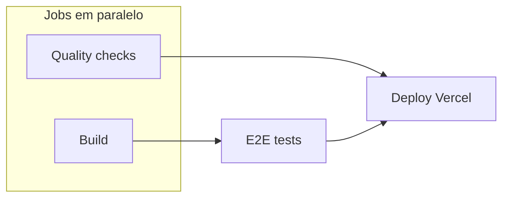

# Buscanime

Aplicação web para explorar animes consumindo a [API GraphQL da AniList](https://docs.anilist.co/guide/graphql/). Inclui listagem com busca e filtros, páginas de detalhe, reviews de usuários, dark mode e pipeline de CI/CD com deploy automático na Vercel.

## Stack

| Categoria         | Tecnologias                                                                                                                                                                     |
| ----------------- | ------------------------------------------------------------------------------------------------------------------------------------------------------------------------------- |
| **Core**          | [React 19](https://react.dev/), [TypeScript](https://www.typescriptlang.org/), [Vite 8](https://vite.dev/)                                                                      |
| **Roteamento**    | [React Router 7](https://reactrouter.com/)                                                                                                                                      |
| **Dados**         | [TanStack Query](https://tanstack.com/query), [graphql-request](https://github.com/jasonkuhrt/graphql-request), [GraphQL Code Generator](https://the-guild.dev/graphql/codegen) |
| **Estado na URL** | [nuqs](https://nuqs.dev/)                                                                                                                                                       |
| **UI**            | [Tailwind CSS v4](https://tailwindcss.com/), [shadcn/ui](https://ui.shadcn.com/), [Radix UI](https://www.radix-ui.com/), [Lucide React](https://lucide.dev/)                    |
| **Validação**     | [Zod](https://zod.dev/)                                                                                                                                                         |
| **Sanitização**   | [DOMPurify](https://github.com/cure53/DOMPurify)                                                                                                                                |
| **Testes**        | [Vitest](https://vitest.dev/), [Testing Library](https://testing-library.com/), [MSW](https://mswjs.io/), [Playwright](https://playwright.dev/)                                 |
| **Qualidade**     | [ESLint](https://eslint.org/), [Prettier](https://prettier.io/), [Husky](https://typicode.github.io/husky/), lint-staged                                                        |
| **Deploy**        | [Vercel](https://vercel.com/), [GitHub Actions](https://github.com/features/actions)                                                                                            |

## Funcionalidades

- Listagem de animes com cards (capa, título, formato, gêneros e score colorido)
- Busca com debounce e filtro por formato (TV, Filme, OVA, etc.)
- Paginação com botão **Ver Mais** e filtros sincronizados na URL
- Página de detalhe com sinopse, episódios, relacionados e preview de reviews
- Página dedicada de reviews com ordenação e carregamento incremental
- Estados de loading (skeleton), erro e vazio
- Dark mode com animação de transição e atalho de teclado
- Tratamento de rotas inválidas (404) e error boundary global

## Rotas

| Rota                  | Página         | Descrição                                                     |
| --------------------- | -------------- | ------------------------------------------------------------- |
| `/`                   | `Home`         | Landing page com hero, destaques e clássicos em destaque      |
| `/animes`             | `AnimeList`    | Listagem principal com busca, filtro por formato e paginação  |
| `/animes/:id`         | `AnimeDetail`  | Detalhes do anime (sinopse, episódios, relacionados, reviews) |
| `/animes/:id/reviews` | `AnimeReviews` | Feed completo de reviews com ordenação                        |
| `*`                   | `NotFound`     | Página 404 para rotas inexistentes                            |

Rotas com `:id` validam o parâmetro no loader do React Router; IDs inválidos retornam 404 antes de renderizar a página.

## Estrutura do projeto

```
buscanime/
├── .github/
│   ├── actions/          # Composite actions reutilizáveis (quality, build, e2e, deploy)
│   └── workflows/ci.yml  # Pipeline de CI/CD
├── e2e/                  # Testes end-to-end (Playwright)
├── public/               # Assets estáticos
├── src/
│   ├── assets/           # Imagens locais (posters de clássicos na home)
│   ├── components/
│   │   ├── anime/        # Cards, grid, busca, filtros, detalhe e reviews
│   │   ├── common/       # ErrorState, EmptyState, NotFound, RootErrorBoundary
│   │   ├── home/         # Seções da landing page
│   │   ├── layout/       # PageContainer e layout compartilhado
│   │   └── ui/           # Componentes shadcn/ui (Button, Card, Input, etc.)
│   ├── hooks/            # useAnimeList, useAnimeDetail, useAnimeReviews, etc.
│   ├── lib/              # Utilitários de UI (cn, animação do theme toggle)
│   ├── pages/            # Componentes de página (Home, AnimeList, AnimeDetail, …)
│   ├── services/anime/   # AnimeService, queries GraphQL e erros de domínio
│   ├── test/             # Setup global dos testes unitários
│   ├── types/
│   │   ├── anime/        # Tipos de domínio (formatos, ordenação de reviews)
│   │   └── generated/    # Tipos gerados pelo GraphQL Code Generator
│   ├── utils/            # Formatação, sanitização, validação de URLs e IDs
│   ├── App.tsx           # Providers (tema, query client, router)
│   ├── main.tsx          # Entry point
│   └── router.ts         # Definição das rotas
├── codegen.ts            # Configuração do GraphQL Code Generator
├── playwright.config.ts
├── vercel.json           # Rewrites SPA e headers de segurança (CSP)
└── vitest.config.ts
```

## Pré-requisitos

> [!IMPORTANT]
> O projeto exige **Node.js >= 22.13.0** e **Yarn** como gerenciador de pacotes.

```bash
# Com nvm instalado
nvm use
```

## Como executar

```bash
# 1. Instalar dependências
yarn install

# 2. (Opcional) Regenerar tipos GraphQL após alterar queries em src/services/anime/
yarn codegen

# 3. Iniciar servidor de desenvolvimento
yarn dev
```

A aplicação estará disponível em `http://localhost:5173`.

### Build de produção

```bash
yarn build      # Typecheck + build para dist/
yarn preview    # Servir o build localmente (porta 4173)
```

## Dark mode

A aplicação suporta tema claro, escuro e sistema (preferência do SO). A preferência é persistida em `localStorage`.

- **Atalho:** `Ctrl` + `D` (ou `Cmd` + `D` no macOS)
- **Botão:** ícone de sol/lua no header
- O atalho é ignorado quando o foco está em campos editáveis (`input`, `textarea`, etc.)

## Scripts

| Script            | Descrição                                      |
| ----------------- | ---------------------------------------------- |
| `yarn dev`        | Servidor de desenvolvimento (Vite)             |
| `yarn build`      | Typecheck + build de produção                  |
| `yarn preview`    | Preview do build local                         |
| `yarn typecheck`  | Verificação de tipos TypeScript                |
| `yarn lint`       | ESLint                                         |
| `yarn format`     | Prettier (arquivos `.ts` e `.tsx`)             |
| `yarn codegen`    | Gera tipos em `src/types/generated/graphql.ts` |
| `yarn test`       | Testes unitários (Vitest, execução única)      |
| `yarn test:watch` | Testes unitários em modo watch                 |
| `yarn test:e2e`   | Testes end-to-end (Playwright)                 |

## Testes

O projeto possui duas camadas de testes automatizados.

### Testes unitários e de componentes

- **Runner:** Vitest com ambiente jsdom
- **Bibliotecas:** Testing Library, MSW (mock de API)
- **Localização:** arquivos `*.test.ts` e `*.test.tsx` junto ao código em `src/`
- **Cobertura:** utilitários, componentes de anime/reviews e seções de detalhe

```bash
yarn test          # execução única
yarn test:watch    # modo interativo
```

### Testes end-to-end

- **Runner:** Playwright (Chromium)
- **Localização:** `e2e/`
- **Fluxos cobertos:** carregamento da listagem, busca, filtro por formato, paginação e navegação para detalhe

Os testes e2e sobem automaticamente o build de produção via `vite preview` na porta `4173`.

```bash
yarn build && yarn test:e2e
```

## CI/CD

O pipeline está configurado em [`.github/workflows/ci.yml`](.github/workflows/ci.yml) e roda em **push para `main`** e em **pull requests**.



| Job                  | Etapas                                     | Quando roda                                 |
| -------------------- | ------------------------------------------ | ------------------------------------------- |
| **Quality checks**   | `yarn lint`, `yarn typecheck`, `yarn test` | Sempre (em paralelo com Build)              |
| **Build**            | `yarn build` + upload do artefato `dist/`  | Sempre (em paralelo com Quality)            |
| **E2E tests**        | Playwright contra o build                  | Após Build concluir                         |
| **Deploy to Vercel** | Deploy do artefato pré-buildado            | Push em `main`, após todos os jobs passarem |

> [!NOTE]
> O deploy automático só é executado quando a variável de repositório `ENABLE_VERCEL_DEPLOY` está definida como `true` e os secrets `VERCEL_TOKEN`, `VERCEL_ORG_ID` e `VERCEL_PROJECT_ID` estão configurados.

Execuções concorrentes do mesmo branch/PR são canceladas automaticamente (`concurrency`).

## Deploy

A aplicação é publicada na [Vercel](https://vercel.com). O `vercel.json` configura rewrites para SPA e headers de segurança (CSP, `X-Frame-Options`, etc.).

| Configuração     | Valor                        |
| ---------------- | ---------------------------- |
| Build command    | `yarn build`                 |
| Output directory | `dist`                       |
| API consumida    | `https://graphql.anilist.co` |

Quando o CI passa em `main` e o deploy está habilitado, o job **Deploy to Vercel** reutiliza o artefato `dist/` gerado no job de build — sem rebuild no deploy.
